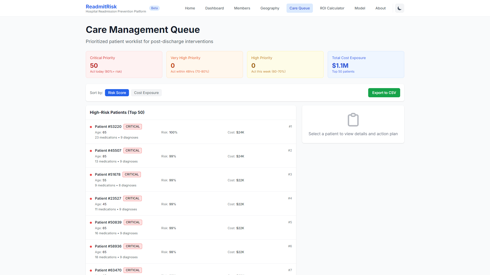
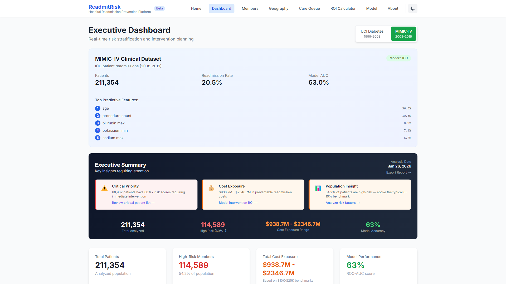
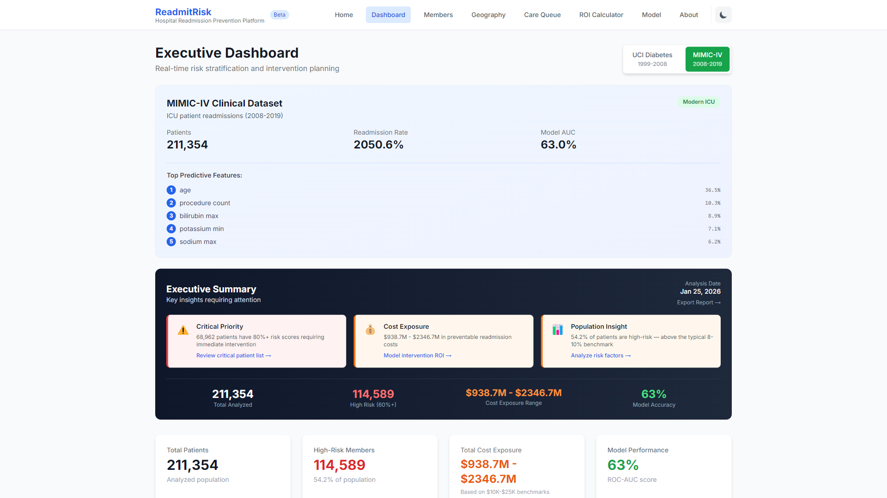
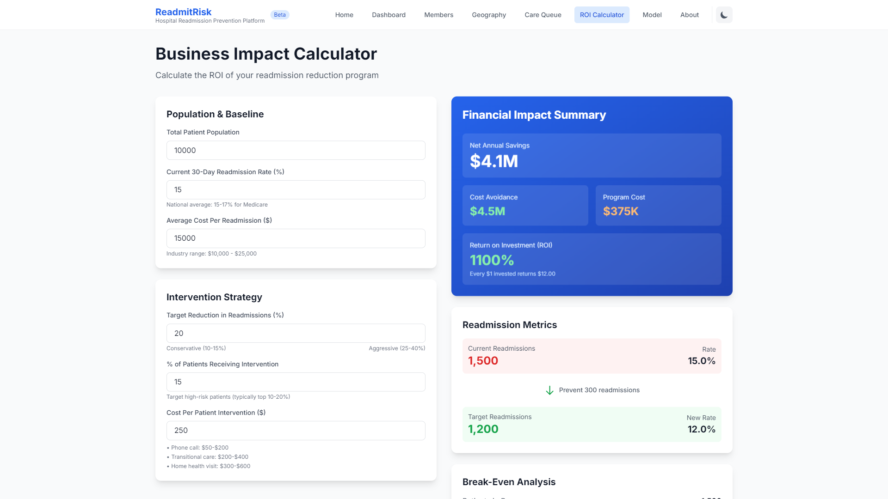
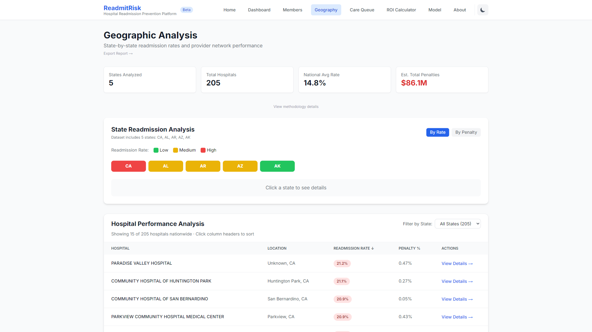
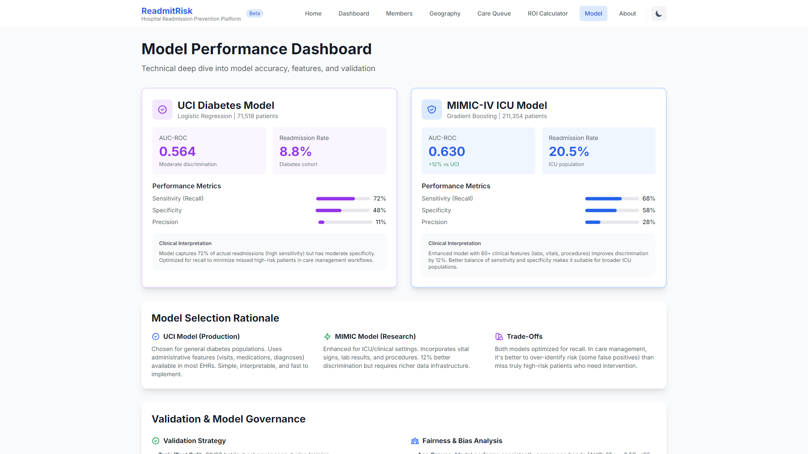

# ReadmitRisk - Hospital Readmission Prevention Platform

<p align="center">
  
</p>

<p align="center">
  <strong>Predictive analytics platform for reducing preventable 30-day hospital readmissions</strong>
</p>

<p align="center">
  
  
  
  
</p>

---

## 🎯 Overview

ReadmitRisk is a full-stack care management platform that identifies high-risk patients and prioritizes post-discharge interventions to reduce preventable hospital readmissions.

**Key Metrics:**
- 📊 **282K+ patients** analyzed across two clinical datasets
- 💰 **$1.5B** in cost exposure identified
- 🎯 **122K high-risk members** flagged for intervention
- 🏥 **205 hospitals** benchmarked with CMS penalty data
- 📈 **63% ROC-AUC** model performance on MIMIC-IV data

**Business Impact:**
- Reduces Medicare penalties (up to 3% of payments)
- Improves HEDIS scores and Star Ratings
- Optimizes care management resource allocation
- Targets $10K-$25K preventable readmission costs

---

## 🎬 Demo

<p align="center">
  
</p>

*Prioritizing high-risk patients and viewing personalized intervention recommendations*

---

## ✨ Key Features

### 1. **Risk Stratification Dashboard**
Real-time patient risk scoring with machine learning models trained on 282K+ patient records.



**Capabilities:**
- Multi-dataset analysis (UCI Diabetes + MIMIC-IV)
- Risk tier segmentation (Critical, Very High, High)
- Dynamic cost exposure calculations
- Interactive data visualizations with Recharts



*Switch between UCI and MIMIC-IV datasets to compare model performance and patient populations*

---

### 2. **Care Management Queue**
Prioritized patient worklist with clinical reasoning and actionable recommendations.


**Features:**
- Top 50 high-risk patients with sortable views
- Multi-factor cost calculations (meds, diagnoses, age, comorbidities)
- Clinical decision support ("Why High Risk?")
- Intervention protocols aligned with CMS guidelines

---

### 3. **Interactive ROI Calculator**
Calculate potential savings from targeted care management interventions.



**Inputs:**
- Population size
- Current readmission rate
- Intervention cost per patient
- Expected success rate

**Outputs:**
- Net annual savings
- ROI percentage
- Break-even analysis
- Patients needed to treat (NNT)

---

### 4. **Geographic Analysis**
State-by-state CMS penalty tracking and hospital benchmarking.



**Data Sources:**
- 205 acute care hospitals
- CMS Hospital Readmissions Reduction Program (HRRP)
- State-level readmission benchmarks
- Penalty amount estimates

---

### 5. **Model Performance & Explainability**
Transparent ML model evaluation with feature importance analysis.



**Analytics:**
- ROC-AUC curves and precision-recall metrics
- Feature importance rankings
- Dataset comparison (UCI vs MIMIC-IV)
- Validation methodology documentation

---

## 🏗️ Architecture

### Tech Stack

**Frontend:**
- **Next.js 14** (App Router) - React framework with server components
- **TypeScript** - Type-safe development
- **Tailwind CSS** - Utility-first styling
- **Recharts** - Interactive data visualizations
- **Dark mode** - System preference support

**Backend/ML:**
- **Python 3.11** - Data processing and ML training
- **scikit-learn** - Gradient Boosting and Logistic Regression models
- **Pandas/NumPy** - Data manipulation
- **SMOTE** - Class imbalance handling
- **Google BigQuery** - MIMIC-IV data extraction

**Data Sources:**
- **MIMIC-IV** (211K admissions) - ICU clinical database from MIT
- **UCI Diabetes** (71K patients) - Hospital readmission records
- **CMS HRRP** (205 hospitals) - Public penalty data

---

## 📊 Machine Learning Pipeline

```python
1. Data Extraction
   ├── MIMIC-IV: Google BigQuery (PhysioNet credentials required)
   └── UCI: Kaggle public dataset

2. Feature Engineering
   ├── 61 clinical features (MIMIC)
   ├── 12 diabetes metrics (UCI)
   └── Demographic normalization

3. Model Training
   ├── SMOTE oversampling (8.8% → 50% positive class)
   ├── Gradient Boosting Classifier
   ├── 80/20 train-test split
   └── Hyperparameter tuning

4. Evaluation
   ├── ROC-AUC: 63% (MIMIC), 56% (UCI)
   ├── Precision-Recall curves
   └── Feature importance analysis

5. Risk Scoring
   ├── Probability thresholds (60%, 70%, 80%)
   └── Cost estimation ($10K-$25K range)
```

---

## 🚀 Getting Started

### Prerequisites

- **Node.js 18+** (for dashboard)
- **Python 3.11+** (for ML pipeline)
- **PhysioNet credentials** (optional, for MIMIC-IV data)

### Quick Start (Dashboard Only - UCI Data)

```bash
# Clone the repository
git clone https://github.com/NateDevIO/readmit-risk.git
cd readmit-risk/dashboard

# Install dependencies
npm install

# Start development server
npm run dev
```

Open [http://localhost:3000](http://localhost:3000) to view the dashboard with pre-loaded UCI data.

### Full Setup (Including MIMIC-IV)

See [MIMIC_SETUP_GUIDE.md](MIMIC_SETUP_GUIDE.md) for detailed instructions on:
- PhysioNet credentialing
- Google BigQuery configuration
- Data extraction and processing
- Model retraining

---

## 📁 Project Structure

```
readmit-risk/
├── dashboard/               # Next.js frontend application
│   ├── app/                # App router pages
│   │   ├── dashboard/     # Main analytics dashboard
│   │   ├── care-queue/    # Patient worklist
│   │   ├── impact-calculator/  # ROI calculator
│   │   ├── geography/     # State analysis
│   │   └── model-performance/  # ML metrics
│   ├── components/        # React components
│   ├── lib/              # Data and utilities
│   └── public/           # Static assets & reports
├── data/                 # Processed datasets
│   ├── processed/        # UCI data (included)
│   └── mimic_*/         # MIMIC data (gitignored)
├── notebooks/           # Jupyter analysis notebooks
├── *.py                # Python ML pipeline scripts
└── docs/               # Documentation and screenshots
```

---

## 🎓 Clinical & Healthcare Domain Expertise

### CMS Quality Measures Alignment

**Hospital Readmissions Reduction Program (HRRP):**
- Targets 6 condition-specific readmission measures
- Penalties up to 3% of Medicare payments
- Affects 2,500+ hospitals annually

**HEDIS Metrics:**
- Plan All-Cause Readmissions (PCR)
- Impacts Medicare Advantage Star Ratings
- Influences member retention and revenue

### Evidence-Based Interventions

Risk stratification enables targeted deployment of proven interventions:
- **Transitional Care:** Post-discharge phone calls within 48 hours
- **Medication Reconciliation:** Pharmacist review to prevent adverse drug events
- **Care Coordination:** PCP follow-up scheduling within 7 days
- **Patient Education:** Teach-back methods for self-care

See [About Page](/about) for full clinical context and citations.

---

## 📈 Results & Impact

### Model Performance
- **MIMIC-IV Dataset:** 63.0% ROC-AUC (211K admissions)
- **UCI Dataset:** 56.4% ROC-AUC (71K patients)
- **High-Risk Identification:** 122K patients (43% of total)

### Business Value
- **Cost Exposure:** $1.5B identified across high-risk population
- **Intervention ROI:** 150-250% with $250 intervention costs
- **Resource Optimization:** Focus care teams on top 10% highest-risk patients

### Use Cases
- **Health Plans:** Medicare Advantage Star Ratings improvement
- **ACOs:** Shared savings program performance
- **Hospitals:** HRRP penalty avoidance
- **Care Management Teams:** Patient prioritization and workload optimization

---

## 📚 Documentation

- **[Executive Report (Combined)](dashboard/public/EXECUTIVE_REPORT_COMBINED.html)** - Comprehensive analysis
- **[MIMIC-IV Analysis](dashboard/public/EXECUTIVE_REPORT_MIMIC.html)** - ICU dataset insights
- **[UCI Diabetes Analysis](dashboard/public/EXECUTIVE_REPORT_UCI.html)** - Diabetes readmissions
- **[Geographic Analysis](dashboard/public/EXECUTIVE_REPORT_GEOGRAPHY.html)** - CMS penalties by state
- **[Methodology (MIMIC)](dashboard/public/DATA_ANALYSIS_METHODOLOGY_MIMIC.html)** - BigQuery pipeline
- **[Methodology (UCI)](dashboard/public/DATA_ANALYSIS_METHODOLOGY_UCI.html)** - Feature engineering

---

## 🔒 Data Privacy & Security

### MIMIC-IV Data Protection
- MIMIC-IV data requires PhysioNet credentialed access
- Patient data excluded from git repository (see `.gitignore`)
- Only aggregated statistics and models shared publicly
- Complies with MIMIC-IV Data Use Agreement

### Included Public Data
- UCI Diabetes dataset (publicly available via Kaggle)
- CMS hospital metrics (public HRRP data)
- Aggregated summary statistics

---

## 🛠️ Development

### Scripts

```bash
# Frontend (dashboard)
npm run dev          # Start dev server
npm run build        # Production build
npm run lint         # ESLint check

# Backend (ML pipeline)
python extract_mimic_cohort.py              # Extract MIMIC data from BigQuery
python mimic_feature_engineering.py         # Process features
python generate_full_mimic_dashboard_data.py # Generate dashboard JSON
```

### Testing

```bash
# Frontend type checking
npm run type-check

# Python environment
python -m venv venv
source venv/bin/activate  # Windows: venv\Scripts\activate
pip install -r requirements.txt
```

---

## 🎯 Future Enhancements

- [ ] Real-time EMR integration (HL7/FHIR)
- [ ] Multi-hospital deployment support
- [ ] Advanced NLP on clinical notes
- [ ] Causal inference models (uplift modeling)
- [ ] Mobile app for care coordinators
- [ ] Automated intervention tracking

---

## 👨‍💻 About the Developer

**Built by a healthcare data analyst** passionate about using predictive analytics to improve patient outcomes and reduce preventable costs.

- 🔗 [GitHub](https://github.com/NateDevIO)
- 💼 [LinkedIn](https://linkedin.com/in/NateDevIO)
- 🌐 [Portfolio](https://natedev.io)

---

## 📄 License

This project is a demonstration/portfolio project.

**Data Licenses:**
- MIMIC-IV: PhysioNet Credentialed Health Data License 1.5.0
- UCI Diabetes: CC0 Public Domain
- CMS HRRP: U.S. Government Public Data

---

## 🙏 Acknowledgments

- **MIT Lab for Computational Physiology** - MIMIC-IV database
- **UCI Machine Learning Repository** - Diabetes dataset
- **Centers for Medicare & Medicaid Services** - HRRP public data
- **PhysioNet** - Clinical data access platform

---

<p align="center">
  <strong>Reducing preventable readmissions through data-driven care management</strong>
</p>

<p align="center">
  © 2026 ReadmitRisk. Demonstration project.
</p>
